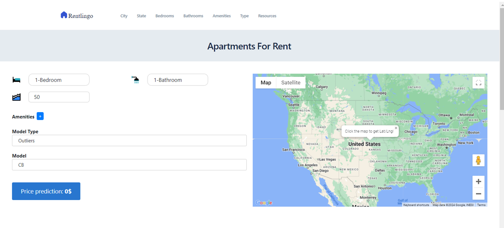
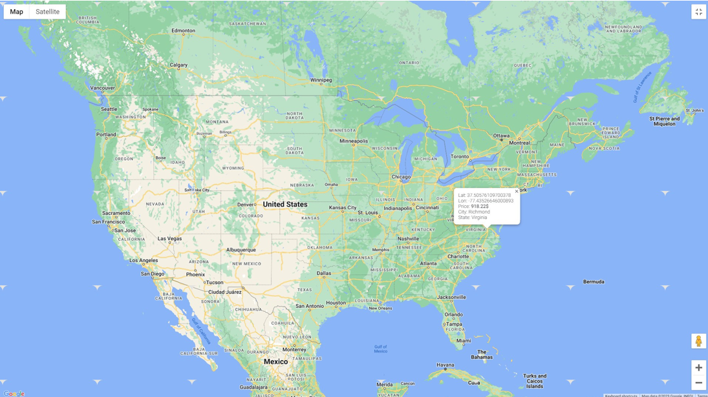

* Hình ảnh demo của đồ án

* Tổ chức thư mục

Dataset
-- apartments for rent classified 100K.csv: file đã được đưa về utf8, sử dụng file này là chính
-- state.txt: state viết tắt và viết đầy đủ
-- us_cities.csv: chứa thành phố, bang, và dân số

Source
-- code: chứa các file code tiền xử lý dữ liệu và huấn luyện các mô hình
-- model: chứa các model đã huấn luyện (https://drive.google.com/drive/folders/1PH_BDEfMNzKswHlbeG0-Hlse0mCAYDmE?usp=drive_link)
-- processor: chứa các bộ tiền xử lý 
-- web
---- loft.html: giao diện web
---- assets: chứa định dạng css và chức năng js của web
-- app.py: sử dụng Flask để làm server để client gọi API
-- model.py: cho app.py gọi các model và các bộ tiền xử lý đã lưu lên để thực hiện chức năng

Visualize
-- EDA apartment.twb: trực quan hóa dữ liệu
11_CuoiKy_51900338_51900440_V2.docx : file báo cáo
504049_PhieuGhiNhanChinhSua_FP.docx : phiếu ghi nhận chỉnh sửa
readme.txt

* Mô tả về bộ dữ liệu

id = id của căn hộ  
category = danh mục  
title = tiêu đề của bài đăng cho thuê nhà  
body = mô tả của căn hộ  
amenities = cá tiện ích như là AC, basketball,cable, gym, internet access, pool, refrigerator etc.  
bathrooms = số phòng tắm  
bedrooms = số phòng ngủ  
currency = đơn vị tính (USD)  
fee = phí (có hoặc không có phí phát sinh)  
has_photo = có hình hay không hay thumbnail  
pets_allowed = những con thú nào được cho phép nuôi, ví dụ: dogs/cats etc.  
price = giá cho thuê của căn hộ  
price_display = giá hiển thị lên khi render (giống với price)  
price_type = cách thanh toán (hàng tháng | hàng tuần)
square_feet = kích thước căn hộ (mét vuông)  
source = nguồn thu thập dữ liệu (các trang web)  
time = ngày tạo bài viết  
address =  địa chỉ số nhà tên đường  
cityname =  thành phố  
state =  tiểu bang
latitude = vĩ độ  
longitude = kinh độ 

Bộ dữ liệu gốc được phân cách bằng ';' và encoding là 'cp1252' (sep=";", encoding='cp1252')
